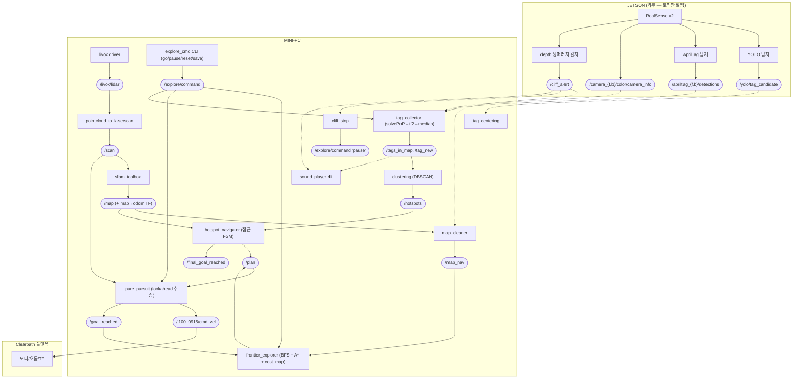

# tag_hotspot_nav — 시스템 아키텍처

> 2D SLAM 기반 AprilTag hotspot 자율탐사 시스템. Nav2 미사용, A\*+Pure Pursuit 직접 구현.
> 연산은 **mini-PC**(SLAM·탐사·주행·태그누적)와 **Jetson**(카메라 인식)으로 분리.

---

## 1. 미션

> **미지 공간을 frontier 자율탐사로 매핑하면서, 벽에 붙은 AprilTag를 카메라로 탐지·map 좌표에 누적하고, 탐사 종료 후 태그가 밀집된 hotspot(클러스터)의 중심으로 자율 이동한다.**

### 시나리오 (Phase)

```
[Phase 1] 매핑 + 태그 수집 (동시 진행)
   frontier 자율탐사로 미지영역을 채워가며 2D 맵(/map) 생성
   └ 그 와중에 Jetson 카메라가 벽 AprilTag 탐지 → solvePnP → map 좌표 누적

[Phase 2] 탐사 종료 판정
   더 갈 frontier 없음 → 매핑 완료
     · 종료 판정 = 자동 (frontier_explorer 가 스스로 /finish_exploration 발행)
     · 저장      = 수동 (사용자가 터미널에서 `save` 입력) ← 현재 구현 기준

[Phase 3] Hotspot 클러스터링   ← 구현됨 (clustering 노드)
   /tags_in_map(ID별 median) 을 DBSCAN(eps=2.0, min=2)으로 클러스터 → 밀집 중심(centroid) 계산
   → /hotspots(PoseArray, 밀집순) + /hotspot_markers 발행

[Phase 4] Hotspot 접근          ← 구현됨 (hotspot_navigator 노드)
   /hotspots(밀집순)를 순서대로 A* 경로계획 → pure_pursuit 주행 → 도착 반복
   (경로계획/추종은 frontier 단계 인프라 PathPlanner·pure_pursuit 그대로 재사용)
   완료 시 /final_goal_reached 발행 → safety_layer 자동 정지
```

### 연산 주체 역할 분담

| 주체 | 책임 |
|------|------|
| **mini-PC** (이 워크스페이스) | 2D SLAM, frontier 탐사, 경로계획/주행, 태그 map 누적, 안전정지, 사운드, 맵 관리 |
| **Jetson** | 카메라 YOLO/AprilTag 탐지, RealSense depth 기반 계단(낭떠러지) 감지 → `/cliff_alert` 발행 |

> Jetson 노드는 Jetson 박스에서 실행되며, mini-PC는 같은 **DDS 네트워크**에서 그 출력 **토픽만 구독**한다 (노드 실행/수정은 불가, 계약 기반).

### 핵심 설계 결정

- **태그 위치추정** = AprilTag corners → `cv2.solvePnP`(IPPE_SQUARE, tag_size 0.14m) → optical frame pose → tf2 로 map 변환 → ID별 **median** 누적
- **장애물**: 양의 장애물(벽/물체)=라이다(`/scan`) 기반 Pure Pursuit 정지 / 음의 장애물(계단)=Jetson depth `/cliff_alert` / 동적 잔상=map_cleaner
- **저장물**: 맵은 `.pgm/.yaml/.posegraph`, 태그는 별도 JSON(`tag_observations.json`)
- **TF 리매핑**: Clearpath bringup 이 TF 를 `/j100_0915/tf` 로 발행 → 모든 우리 노드 `/tf → /j100_0915/tf` 리매핑 필수

### 현재 진행 상태

- ✅ Phase 1 (매핑+태그수집) 실기체 풀체인 검증 완료
- ✅ Phase 2 (종료판정 자동 / 저장 수동) 동작
- 🟡 Phase 3 (DBSCAN 클러스터링) — clustering 노드 구현, 실기체 검증 전
- 🟡 Phase 4 (hotspot 접근 FSM) — hotspot_navigator 노드 구현, 실기체 검증 전
- ⚠ 미해결: 카메라 extrinsic placeholder(태그 정밀도 미보정), Jetson cliff 평지 오탐

---

## 2. 토픽 정리

### A. mini-PC 노드별 Pub / Sub

| 노드 | 구독 (SUB) | 발행 (PUB) | 서비스 |
|------|-----------|-----------|--------|
| **frontier_explorer** | `/map`(또는 `/map_nav`), `/goal_reached`, `/explore/command` | `/plan`, `/finish_exploration`, `/frontier_centroids`(viz), `/frontier_cells`(viz) | client: `/slam_toolbox/reset` |
| **pure_pursuit** | `/plan`, `/scan`, `/explore/command` | `/j100_0915/cmd_vel`(또는 `/cmd_vel_raw`), `/goal_reached`, `/obstacle_block` | — |
| **tag_collector** | `/apriltag_front/detections`★, `/apriltag_back/detections`★, `/camera_front/color/camera_info`★, `/camera_back/color/camera_info`★, `/explore/command` | `/tags_in_map`, `/tag_new` | — |
| **tag_centering** | `/yolo/tag_candidate`★, `/explore/command`, `/tags_in_map` | `/j100_0915/cmd_vel`, `/explore/command` | — |
| **clustering** | `/tags_in_map` | `/hotspots`(PoseArray, 밀집순), `/hotspot_markers`(viz) | — |
| **hotspot_navigator** | `/hotspots`, `/finish_exploration`, `/goal_reached`, `/map`, `/explore/command` | `/plan`, `/final_goal_reached` | — |
| **map_cleaner** | `/map`, `/scan`, `/cliff_alert`★, `/explore/command` | `/map_nav` | — |
| **cliff_stop** | `/cliff_alert`★ | `/explore/command` | — |
| **stuck_detector** | `/j100_0915/cmd_vel`, `/j100_0915/platform/odom` | `/stuck` | — |
| **safety_layer** (기본 off) | `/cmd_vel_raw`, `/scan`, `/pause`, `/j100_0915/platform/odom`, `/final_goal_reached` | `cmd_vel`, `/safety/state`, `/pause` | — |
| **sound_player** | `/explore/command`, `/tag_new`, `/obstacle_block`, `/cliff_alert`★, `/stuck`, `/safety/state`, `/j100_0915/joy_teleop/joy` | — (mpg123 오디오 출력) | — |
| **explore_cmd** (go/pause/reset/save CLI) | — | `/explore/command` | client: slam_toolbox save/serialize |

★ = Jetson 이 발행하는 외부 토픽

### B. 외부 토픽

**Jetson 발행 (mini-PC 가 구독):**

| 토픽 | 타입 | 소비 노드 |
|------|------|----------|
| `/apriltag_{front,back}/detections` | `apriltag_msgs/AprilTagDetectionArray` | tag_collector |
| `/camera_{front,back}/color/camera_info` | `sensor_msgs/CameraInfo` | tag_collector (solvePnP K) |
| `/yolo/tag_candidate` | `custom_msgs/TagCandidate` | tag_centering |
| `/cliff_alert` | `std_msgs/Bool` | cliff_stop, map_cleaner, sound_player |
| `/cliff_debug_{front,back}`, `/camera_*/color`, `/camera_*/depth/image_rect_raw` | `sensor_msgs/Image` | (Foxglove 열람용) |

**SLAM 파이프라인 (slam_2d.launch 가 띄우는 외부/벤더 노드):**

| 노드 | 패키지 | 입력 → 출력 |
|------|--------|------------|
| livox_lidar_publisher | livox_ros_driver2 | MID360 → `/livox/lidar` (PointCloud2) |
| pointcloud_to_laserscan | pointcloud_to_laserscan | `/livox/lidar` → `/scan` (z 0.2~0.6m 벽 슬라이스) |
| slam_toolbox | slam_toolbox | `/scan` + 휠오돔 TF → `/map` + map→odom TF |
| static_transform_publisher | tf2_ros | `base_link→livox_frame`, `base_link→camera_*`(placeholder) |

**Clearpath 플랫폼 (roas2_bringup, 항상 가동):** `/j100_0915/cmd_vel`(입력), `/j100_0915/platform/odom`, `/j100_0915/tf(_static)`, `/j100_0915/joy_teleop/joy` 등

---

## 3. 데이터 흐름 다이어그램



> 점선(`-.->`) = Jetson→mini-PC DDS 경계를 넘는 흐름. viz 전용 토픽(`/frontier_centroids` 등)은 생략.

---

## 4. 사용 알고리즘

### 코드 검증 결과 (질문된 항목)

| 항목 | 사용? | 실제 구현 |
|------|------|----------|
| **Costmap** | ✅ (직접 구현) | Nav2 costmap_2d **아님**. `grid_utils.py`: ①**C-space inflation**(`calc_cspace` — 장애물을 robot_radius 만큼 binary dilation, scipy 없이 numpy roll) ②**cost map**(`calc_cost_map` — 경계에서 ring 반복 팽창, 벽에 가까울수록 높은 비용 → A\* 가 복도 중앙 선호) |
| **Frontier** | ✅ | `frontier_detection.py` — **BFS 기반**(KaiNakamura/slam_robot 포팅). free 영역 4-연결 BFS, frontier = unknown∩free-인접, 8-연결 BFS 군집화, centroid·size 계산 (min_size 8) |
| **Pure Pursuit** | ✅ | `pure_pursuit.py` — **기하학적 pure pursuit**. lookahead 0.4m 목표점, 곡률 `2·ly/d²`, 라이다 전방섹터 min-range 감속/정지 |
| **A\*** | ✅ | `path_planner.py` — heapq + **octile heuristic** + cost_map 가중. goal 도달불가 시 부분경로 폴백 |

### 프로젝트 소개용 알고리즘 목록

**A. mini-PC (자율탐사·주행·매핑)**

1. **2D Graph SLAM** — slam_toolbox(online async). scan matching + pose graph + loop closure → `/map` + map→odom TF
2. **PointCloud → LaserScan 슬라이싱** — 3D MID360 점군을 z 0.2~0.6m 벽 높이만 잘라 2D `/scan` 으로 변환
3. **Frontier 탐지 (BFS)** — 미탐사 경계를 찾아 다음 목적지 후보 생성
4. **C-space Inflation + Cost Map** — 장애물 팽창(충돌회피) + 벽 근접 비용(복도 중앙 선호)
5. **A\* 전역 경로계획** — octile 휴리스틱, cost map 가중, 부분경로 폴백
6. **Pure Pursuit 경로추종** — lookahead 기반 곡률 제어로 cmd_vel 생성
7. **AprilTag 위치추정: solvePnP (PnP, IPPE_SQUARE)** — corners[4]+camera K → optical pose → tf2 로 map 변환
8. **Median 누적 (robust estimation)** — ID별 관측 median 으로 드리프트/이상치 흡수
9. **DBSCAN 클러스터링** — 🟡 *clustering 노드*. `/tags_in_map`(ID별 median)을 numpy DBSCAN(eps=2.0, min=2)으로 밀도 클러스터링 → hotspot centroid(count 가중) 산출 → `/hotspots` (실기체 검증 전)
10. **Hotspot 접근 FSM** — 🟡 *hotspot_navigator 노드*. `/finish_exploration` 후 `/hotspots`(밀집순)를 순차로 A*(PathPlanner 재사용)→`/plan`→pure_pursuit 주행→`/goal_reached` 반복. 타임아웃/무진전 시 재계획·스킵, 완료 시 `/final_goal_reached` (실기체 검증 전)
11. (보조) **Reactive safety stop**(라이다 섹터 min-range), **ray-based map cleaning**(동적잔상 제거+keep-out), **stuck 감지**(cmd vs odom 불일치)

**B. Jetson (인식)**

12. **YOLO 객체 탐지** — 태그 후보 영역 검출 → `/yolo/tag_candidate`
13. **AprilTag 탐지** — homography/코너 검출로 태그 ID·corners 추출
14. **Depth 기반 낭떠러지(계단) 감지** — RealSense depth ROI 에서 바닥 유무 판정 → `/cliff_alert` (라이다는 MID360 하향 FOV -7° 한계로 근접 계단 감지 불가 → depth 로 이관)

> **한 문장 요약**: "2D Graph SLAM 으로 지도를 만들며 Frontier+A\*+Pure Pursuit 로 자율탐사하고, Jetson 의 YOLO·AprilTag 인식과 PnP·median 누적으로 태그를 map 에 모은 뒤, DBSCAN 으로 hotspot 을 찾아 접근하는 시스템."
